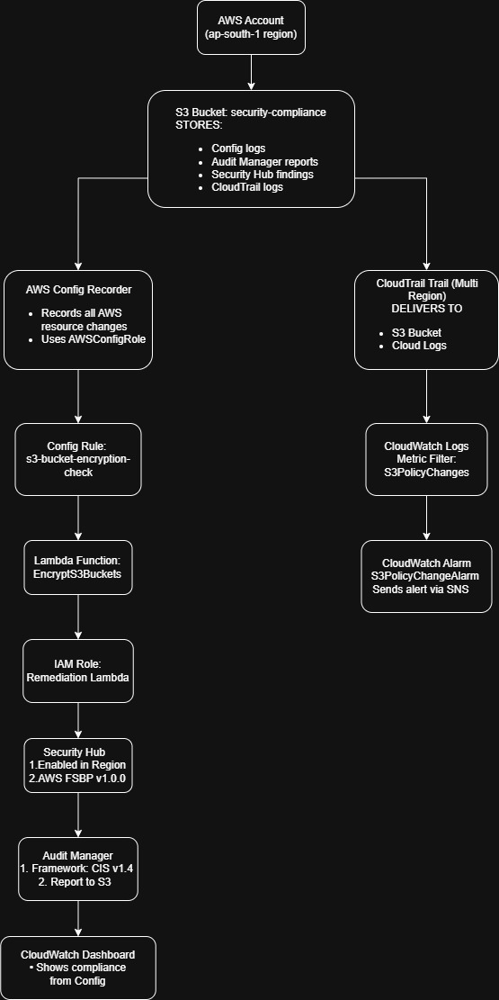

# AWS Compliance Suite – Security Automation with PowerShell and AWS CLI

A fully automated compliance framework built with PowerShell and AWS CLI, designed to configure, enforce, and validate cloud-native security controls across AWS environments. This solution follows a structured, phase-based approach aligned with industry standards to simulate real-world cloud security operations and automated remediation workflows.

## Overview

It streamlines the setup of foundational AWS security services, enforces policy-based controls, and validates compliance through continuous monitoring and reporting. The approach integrates configuration auditing, threat detection, automated remediation, and compliance visualization; all implemented through CLI-driven automation. The solution reflects real-world scenarios aligned with the responsibilities of cloud security analysts and DevSecOps teams.

This suite reflects the scope of responsibilities typically handled by Cloud Security Analysts and DevSecOps professionals.

## Security Controls Implemented

Enforced default server-side encryption across all Amazon S3 buckets.

Evaluated and remediated AWS resources using AWS Config managed rules.

Activated Security Hub with foundational security best practices enabled.

Deployed CIS AWS Foundations assessment through AWS Audit Manager.

Centralized API activity logging via CloudTrail with CloudWatch alerts.

Built a real-time CloudWatch dashboard for compliance visibility.

## Repo Structure

```text
aws-compliance-suite-portfolio/
├── 01_scripts/                           # PowerShell scripts for each automation phase
│   ├── phase1-create-bucket.ps1
│   ├── phase2-aws-configrole.ps1
│   ├── phase3-awsconfig-recorder.ps1
│   ├── phase4-s3-encryption-rule.ps1
│   ├── phase5-aws-securityhub.ps1
│   ├── phase6-auditmanager-setup.ps1
│   ├── phase7-cloudtrail-cloudwatch.ps1
│   ├── phase8-automated-remediation.ps1
│   └── phase9-compliance-dashboard.ps1

├── 02_aws_compliance_screenshots/        # Screenshot evidence for each phase
│   ├── phase1/                           # Refer this folder for screenshots
│   ├── phase2/
│   ├── phase3/
│   ├── phase4/
│   ├── phase5/
│   ├── phase6/
│   ├── phase7/
│   ├── phase8/
│   └── phase9/

├── 03_architecture/                      # High-level system architecture
│   └── aws-compliance-architecture.jpg

└── README.md
```

## Architecture Diagram



## Implementation Scope
Phase 1 – S3 Bucket Creation
Creates a secure bucket to store AWS Config and Audit Manager data.

Phase 2 – IAM Role for AWS Config
Sets up an IAM role and trust policy allowing AWS Config to record resource configurations.

Phase 3 – Config Recorder & Delivery Channel
Enables AWS Config with S3 delivery, creating the recorder and delivery channel.

Phase 4 – Config Rule: S3 Bucket Encryption
Defines a managed AWS Config rule to evaluate if all S3 buckets have server-side encryption enabled.

Phase 5 – AWS Security Hub
Enables Security Hub and activates the AWS Foundational Security Best Practices standard.

Phase 6 – Audit Manager Setup
Creates a CIS-based audit assessment using the AWS Audit Manager and stores evidence in S3.

Phase 7 – CloudTrail & CloudWatch Logging
Enables multi-region CloudTrail logging to S3 and CloudWatch Logs with metric filters and alarms for security events.

Phase 8 – Automated Remediation
Deploys a Lambda function that automatically encrypts unencrypted S3 buckets when the Config rule is non-compliant.

Phase 9 – CloudWatch Compliance Dashboard
Creates a real-time dashboard to visualize compliance metrics and S3 policy change events.

## Execution Environment

This was built and validated in a real AWS environment using:

AWS CLI (v2+)

PowerShell Core (v7+)

AWS Identity and Access Management (IAM)

AWS Config, S3, CloudTrail, CloudWatch, Audit Manager, Security Hub, Lambda

Placeholders such as <ACCOUNT_ID> and <YOUR_BUCKET_NAME> are intentionally included in the scripts for clarity and safe reuse.

## Security and Design Notes

All scripts follow least-privilege IAM principles

Sensitive values such as ARNs and account numbers are masked

IAM roles, S3 bucket policies, and trust relationships are scoped and controlled

Lambda is tightly permissioned for only encryption-related actions

## Author

Noufa Sunkesula  
 
Email: noufasunkesula@gmail.com

Contact: +91 8106859686


